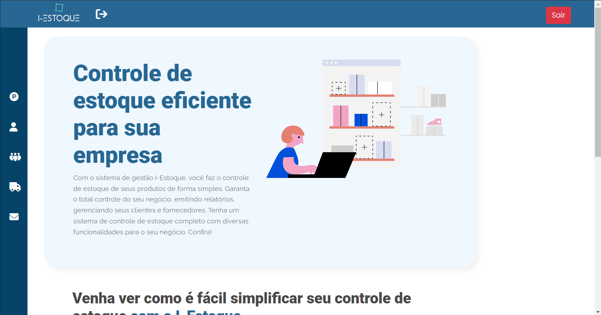
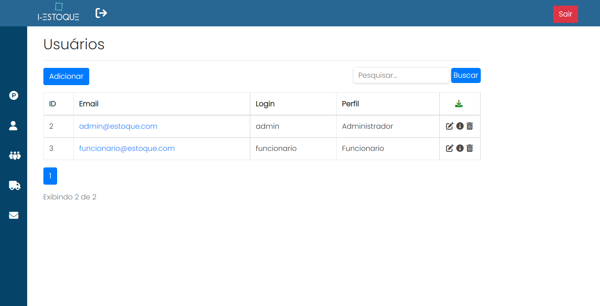
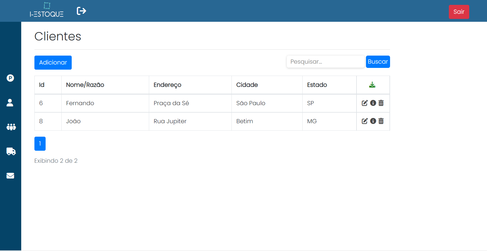
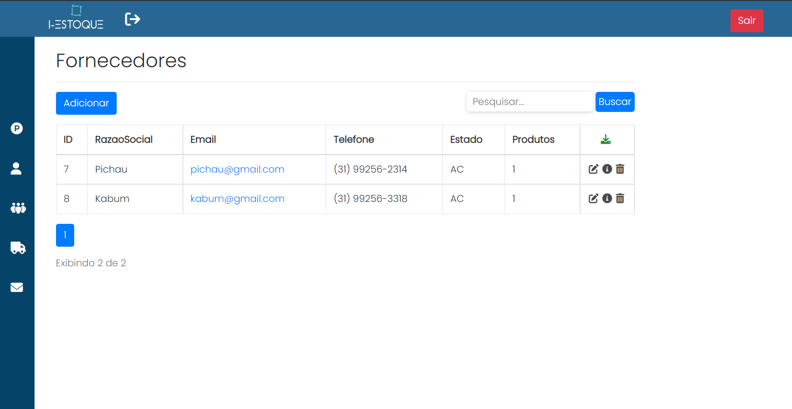

## Projeto AspNetCoreMvc - PUC Minas
Este repositório mantém os códigos fontes do projeto de conceito elaborado para o trabalho de conclusão do 2° semestre do curso Análise e desenvolvimento de sistemas

## Escopo do projeto
O escopo escolhido para o trabalho foi o de sistema de controle de estoque.

## Técnologias utilizadas
#### Backend
- C#
- AspNet Core
- EntityFramework
- SQL Server

#### Frontend
- Jquery
- HTML
- CSS
- Bootstrap

#### API
- ViaCep

## Executando a aplicação
1. Acessar o <a href="http://josecosta1984-001-site3.etempurl.com/">site</a>.
2. Para o acesso ao sistema, o usuário de Administrador e Funcionário ja é criado:
   
<b>Credencial Administrador</b>:
- <b>Login</b>: administrador
- <b>Senha</b>: 123456
- <b>Login</b>: funcionario
- <b>Senha</b>: 123456

## Imagens do Projeto
<b>Homepage:</b>

---
<b>Tabela de produtos:</b>

---
<b>Tabela de Usuários:</b>

---
<b>Tabela de clientes:</b>

---
<b>Tabela de fornecedores:</b>

